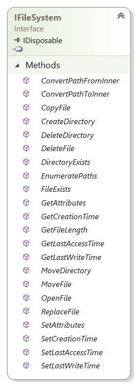

# The Zio FileSystem User Manual



## Overview

Zio is structured around the following concepts:

- The core interface is `Zio.IFileSystem`

- A lightweight uniform path as a struct `UPath` used by all `IFileSystem` methods

- Many built-ins filesystems available from the namespace `Zio.FileSystems`

- Simple "higher" level API through `FileSystemEntry`, `FileEntry` and `DirectoryEntry` (similar to `FileSystemInfo`, `FileInfo` and `DirectoryInfo` from `System.IO`)

## Normalized paths with `UPath`

All paths in Zio are using a structure `UPath` that represents a uniform path information (either a file or a directory)

**Why** this is needed? By normalizing the path used through the API, we can more efficiently verify malformed paths, allow to cache them without asking if it is of the same form. Typically, with `System.IO.Path` when you perform a `Path.Combine` with `C:\This\Path` and `../Test`, you will get `C:\This\Path\../Test`, but if you try to use this as a key, it will not match the real final directory `C:\This\Path\Test`. 

`UPath` tries to address this problem with the following core concepts:

- A `UPath` can be absolute (starting by a leading `/`) or relative (e.g `name/path` or `../../path`)
- A `UPath` is normalized like a Unix file or directory path:
  - The character `/` is used to separate directories
  - The character `\` is replaced by `/`
  - The parent directory `..` or current directory `.` in an absolute path are squashed and remove
  - Any consecutive `/` are squashed
  - Any trailing `/` are removed
- A `UPath` can be safely used in as a key of a `IDictionary<TKey,TValue>`
- A `UPath` is memory efficient (contains a single string of the normalized path)
- Creating a path that is already `UPath` normalized doesn't create a new allocation

```c#
var path = (UPath)"/this/is/a/path/to/a/directory"
```

The `UPath` allows to combine path either by using `UPath.Combine` or the `/` operator:

```c#
// Equivalent to UPath.Combine(path, "myfile.txt")
var filePath = path / "myfile.txt";
```

If a path is absolute, and contains unnecessary `..` or `.`, they will be squashed and removed:

```c#
var path = (UPath)@"/this\is/wow/../an/absolute/./path/"

// Prints /this/is/an/absolute/path
Console.WriteLine(path); 
```

## The interface `IFileSystem`


The [`IFileSystem` interface](https://github.com/xoofx/zio/blob/master/src/Zio/IFileSystem.cs) is the central interface that makes Zio filesystem abstraction powerful. It is in fact partly inspired on how the internals of CoreCLR is developed around an abstract class called [`FileSystem`](https://github.com/dotnet/corefx/blob/19edd49851626fd32433688078ebbf8ad8368de3/src/System.IO.FileSystem/src/System/IO/FileSystem.cs).

All methods are simply exposed through a single interface. These methods provide **the same level of features** that are exposed through different classes in `System.IO`, **including the expected exceptions** returned by these methods.

This is a key concept of Zio: While the `IFileSystem` abstract the filesystem, it should provide all the features of the existing `System.IO` APIs that are currently exposed in .NET, without removing optimized scenarios (e.g if `File.Move` exists, while we could provide only a `Delete+Copy`, it is because the OS itself can provide such optimized method - which is usually atomic, so it is important to keep this level of features) 

The `IFileSystem` API is mainly divided into 4 groups:

- **Directory API**

<table width='100%'>
<thead>
<tr>
<th style="width:40%"><code>System.IO API</code></th>
<th><code>Zio.IFileSystem API</code></th>
</tr>
</thead>
<tbody>
<tr>
<td><code>Directory.Create</code></td>
<td><code>IFileSystem.CreateDirectory</code></td>
</tr>
<tr>
<td><code>Directory.Delete</code></td>
<td><code>IFileSystem.DeleteDirectory</code></td>
</tr>
<tr>
<td><code>Directory.Exists</code></td>
<td><code>IFileSystem.DirectoryExists</code></td>
</tr>
<tr>
<td><code>Directory.Move</code></td>
<td><code>IFileSystem.MoveDirectory</code></td>
</tr>
</tbody>
</table>

- **File API**

<table width='100%'>
<thead>
<tr>
<th style="width:40%"><code>System.IO API</code></th>
<th><code>Zio.IFileSystem API</code></th>
</tr>
</thead>
<tbody>
<tr>
<td><code>File.Copy</code></td>
<td><code>IFileSystem.CopyFile</code></td>
</tr>
<tr>
<td><code>File.Replace</code></td>
<td><code>IFileSystem.ReplaceFile</code></td>
</tr>
<tr>
<td><code>FileInfo.Length</code></td>
<td><code>IFileSystem.GetFileLength</code></td>
</tr>
<tr>
<td><code>File.Exists</code></td>
<td><code>IFileSystem.FileExists</code></td>
</tr>
<tr>
<td><code>File.Move</code></td>
<td><code>IFileSystem.FileMove</code></td>
</tr>
<tr>
<td><code>File.Delete</code></td>
<td><code>IFileSystem.FileDelete</code></td>
</tr>
<tr>
<td><code>File.Open or FileStream</code></td>
<td><code>IFileSystem.OpenFile</code></td>
</tr>
</tbody>
</table>

- **Metadata API** that can apply for both File and Directory

<table width='100%'>
<thead>
<tr>
<th style="width:40%"><code>System.IO API</code></th>
<th><code>Zio.IFileSystem API</code></th>
</tr>
</thead>
<tbody>
<tr>
<td><code>File.GetAttributes</code></td>
<td><code>IFileSystem.GetAttributes</code></td>
</tr>
<tr>
<td><code>File.SetAttributes</code></td>
<td><code>IFileSystem.SetAttributes</code></td>
</tr>
<tr>
<td><code>File.GetCreationTime</code></td>
<td><code>IFileSystem.GetCreationTime</code></td>
</tr>
<tr>
<td><code>File.SetCreationTime</code></td>
<td><code>IFileSystem.SetCreationTime</code></td>
</tr>
<tr>
<td><code>File.GetLastAccessTime</code></td>
<td><code>IFileSystem.GetLastAccessTime</code></td>
</tr>
<tr>
<td><code>File.SetLastAccessTime</code></td>
<td><code>IFileSystem.SetLastAccessTime</code></td>
</tr>
<tr>
<td><code>File.GetLastWriteTime</code></td>
<td><code>IFileSystem.GetLastWriteTime</code></td>
</tr>
<tr>
<td><code>File.SetLastWriteTime</code></td>
<td><code>IFileSystem.SetLastWriteTime</code></td>
</tr>
</tbody>
</table>

- **Search API**

<table width='100%'>
<thead>
<tr>
<th style="width:40%"><code>System.IO API</code></th>
<th><code>Zio.IFileSystem API</code></th>
</tr>
</thead>
<tbody>
<tr>
<td><code>Directory.EnumerateFiles</code><br>
<code>Directory.EnumerateDirectories</code><br>
<code>Directory.EnumerateFileSystemEntries</code>
</td>
<td><code>IFileSystem.EnumeratePaths</code></td>
</tr>
</tbody>
</table>

- **Watch API**

<table width='100%'>
<thead>
<tr>
<th style="width:40%"><code>System.IO API</code></th>
<th><code>Zio.IFileSystem API</code></th>
</tr>
</thead>
<tbody>
<tr>
<td><code>new FileSystemWatcher(...)</code></td>
<td><code>IFileSystemWatcher</code><br>
<code>IFileSystem.Watch</code>
</td>
</tr>
</tbody>
</table>

> The **IDisposable** pattern
>
> While current built-ins filesystem are not using this feature, a `IFileSystem` is `IDisposable` in case it would rely its internals on an underlying `IDisposable` object

Also [many extension methods](https://github.com/xoofx/zio/blob/master/src/Zio/FileSystemExtensions.cs) are provided for the `Zio.IFileSystem` (e.g `IFileSystem.ReadAllText`) to mimic some of the utility methods exposed by the `System.IO.File` API.

## Using The FileSystems

The default filesystems provided by Zio comes roughly into two kinds:

- **Concrete file systems** : These are "terminal" filesystems that are bound to a direct storage

  - `PhysicalFileSystem` operating on the physical disk, straight redirection to all `System.IO` methods

  - `MemoryFileSystem` operating in-memory

- **Composite file systems** : These are used to built higher level filesystems by composing them with Concrete and Composite filesystems

  - `AggregateFileSystem` providing a merged view read-only filesystem over multiple filesystems
  
  - `MountFileSystem` allowing to mount filesystems on specific mount names

  - `SubFileSystem` exposing a sub path of an existing filesystem as a root filesystem

  - `ReadOnlyFileSystem` allowing to expose a filesystem as read-only

> Note that all filesystems, concrete and composite, are **thread-safe**.

The class hierarchy is fairly simple:


> You will notice an abstract `FileSystem` inheriting from `IFileSystem`
>
> This is the base class that provides the infrastructure for checking correct parameters for all the `IFileSystem` methods and implement the `IDisposable` pattern. Typically, this abstract class checks for absolute paths arguments.
>
> When implementing a `IFileSystem`, it is recommended to derive from this class.
 
### Concrete FileSystem

#### `PhysicalFileSystem`

This is a direct implementation of the `IFileSystem` on top of all existing `System.IO.File and System.IO.Directory` methods as described above. 

```C#
var fs = new PhysicalFileSystem();

fs.DirectoryCreate("/mnt/c/Temp/Test");
```

Unlike `System.IO.File/Directory`, `PhysicalFileSystem` provides **uniform paths and platform abstraction** on `Windows`, `Linux` and `OSX`

> Typically, on **Windows, all the drives are "mounted" in the folder `/mnt` like the way Windows Subsystem for Linux is working**. 
>
> If you want to access the drive `C:\`, you will have to access the path `/mnt/c`. This is making Zio FileSystem paths uniform across OS. 
>
> It means also that the root `/` folder on Windows is emulated in `PhysicalFileSystem` so that it contains a single directory `/mnt` and all available drives are exposed under the `/mnt` folder (e.g `/mnt/c` note lowercase, for `C:\`)

You can use the method `IFileSystem.ConvertPathFromInternal` to convert a representation of an internal path (`C:\Windows\System32`) to a Zio path (`/mnt/c/Windows/System32`). The reverse method `IFileSystem.ConvertPathToInternal` can also be useful.

These methods are also useful for composite filesystems (e.g `SubFileSystem` that remaps a sub-folder to a root folder)

#### `MemoryFileSystem`

This filesystem provides an implementation of `IFileSystem` that tries to mimic the behavior of a real `PhysicalFileSystem`, while performing all operations in memory.

```C#
var fs = new MemoryFileSystem();

fs.DirectoryCreate("/mnt/c/Temp/Test");
```

First, the internal structure of this filesystem is using a node per filesystem entry (a file or directory), and each node has a lock (shared or exclusive).

Secondly, Zio `MemoryFileSystem` tries to follow carefully the design principle of hierarchical locking strategy explained in the [Unix kernel filesystems](https://www.kernel.org/doc/Documentation/filesystems/directory-locking) so that it should provide an efficient localized locking mechanism while being thread safe (and hopefully deadlock free)

This unique internal design allow this filesystem to provide:

- Real atomic operations for operations like `File.Replace` or `Directory.Move`
- Similar behavior to file/directory locking: If you perform a `IFileSystem.OpenFile`, the directory of the file will be locked.
- Similar behavior to `FileShare`: You can open a file with read, read-write, or write only shared options.
- Exceptions returned by `MemoryFileSystem` are trying to follow the behavior of a `PhysicalFileSystem`
- Very fast in-memory access (x40+ faster than a regular filesystem on a SSD)

In addition to a much faster filesystem in memory compare to a `PhysicalFileSystem`, the method `MemoryFileSystem.Clone()` provides also a useful utility method to efficiently clone the entire filesystem.

**This filesystem can be used for mocking scenarios** while keeping the behavior of a real filesystem.

### Composite FileSystem

Composite filesystems allow to build and compose more complex filesystems on top of existing concrete filesystems or others composite filesystems.

#### `AggregateFileSystem` 

This filesystem provides a merged read-only view of multiple filesystems that are registered on it.

```c#
var aggregatefs = new AggregateFileSystem();

// Provides a merge view of fs2 over fs1 filesystem
aggregatefs.AddFileSystem(fs1);
aggregatefs.AddFileSystem(fs2);
```

The order of registration dictates the order of the merge view and file/directory overrides. If a file or directory is present in a FileSystem, it will override any files that are in other filesystems that were registered previously in the aggregate filesystem.

In the example above, all files/directories in the `fs2` filesystem have a higher priority than files in `fs1` filesystem.

**Example**

If `fs1` has the following folder/file hierarchy:

```
/a
    file1.txt
    file2.txt
file3.txt
```

and `fs2` has the following folder/file hierarchy:

```
/a
    file1.txt
    file4.txt
/b
    file5.txt
```


The `AggregateFileSystem` will expose this read-only filesystem:

```
/a                       | fs2
    file1.txt            | fs2
    file2.txt            | fs1
    file4.txt            | fs1
/b                       | fs2
    file5.txt            | fs2
file3.txt                | fs1
```

It is thus important that underlying `IFileSystem` are not modified when using them through an aggregate filesystem in order to keep the folder/file structure consistent.

An `AggregateFileSystem` accepts also directly a backup/failsafe `IFileSystem` in its constructor. This `IFileSystem` will be always resolved last and cannot be removed by using `AggregateFileSystem.AddFileSystem/RemoveFileSystem`

#### `MountFileSystem` 

This filesystem allows to mount different `IFileSystem` on specific root mount names.

```c#
var mountfs = new MountFileSystem();

mountfs.Mount("/fs1", fs1);
mountfs.Mount("/fs2", fs2);
```

An enumeration of the root folder `/` will display `/fs1` and `/fs2` as folders and they will appear as part of the same filesystem, despite being exposed by different filesystems.

> Note that unlike a regular concrete filesystem like `MemoryFileSystem`, some operations on a `MountFileSystem` are not atomic (`File.Replace`) when they are performed across different mounts. In that case, they are emulated with standard delete/move/copy operations.

Like the `AggregateFileSystem`, the `MountFileSystem` constructor allows to take a backup/failsafe `IFileSystem` that is mounted on the `/` root folder. But it allows this filesystem to be written to.

#### `SubFileSystem` 

This filesystem is useful to expose the sub-folder of a existing filesystem as if it was a root filesystem, typically disallowing to go to a above this "root" parent folder.

```c#
var fs = new PhysicalFileSystem();
var subfs = new SubFileSystem(fs, "/mnt/c/Temp");

// Actually creates a folder Test in /mnt/c/Temp
subfs.DirectoryCreate("/Test");
```

#### `ReadOnlyFileSystem` 

The readonly filesystem simply allows to expose an existing filesystem as read-only and throws a `System.IO.IOException` on any attempt to use one of the writeable `IFileSystem` methods.

## `IFileSystemWatcher`

All filesystems provide support for watching directory/file changes. The `IFileSystem` provides the method `Watch` with a folder to watch for changes (which is immutable once being watched):

```C#
IFileSystemWatcher Watch(UPath path);
```

The interface returned is very similar to the [`System.IO.FileSystemWatcher`](https://msdn.microsoft.com/en-us/library/system.io.filesystemwatcher(v=vs.110).aspx)

## Implementing a FileSystem

IF you need to implement your own `IFileSystem`, you first need to decide if your filesystem will be a concrete or a composite (or even both) filesystem.

Depending on this pre-requisites, you may have to derive from:

- `FileSystem` abstract class for a concrete filesystem or a specific hybrid concrete/composite filesystem
- `ComposeFileSystem`  abstract class for a composite filesystem that requires for example an underlying `IFileSystem`

After deriving, you will need to provide an implementation for all the `IFileSystem` method that are actually calling in this abstract classes the methods with an `Impl` suffix. These methods are called after the base `FileSystem` class has performed some basic checks on paths (e.g requiring that all paths are absolute)
